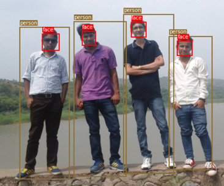
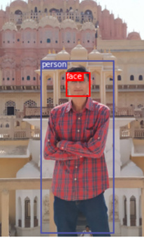
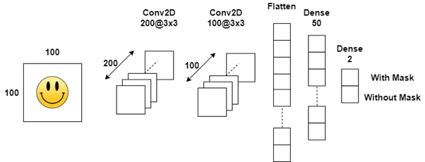
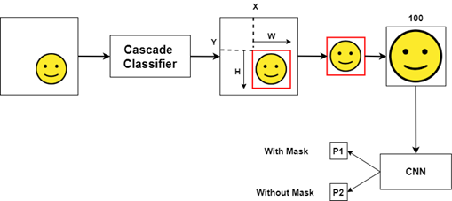
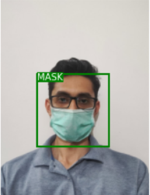
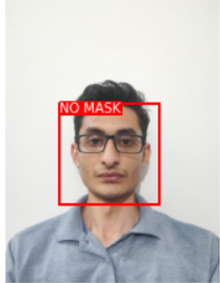
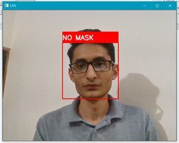
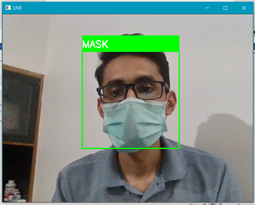

**FACEMASK DETECTION SYSTEM**
=================================================

MODULE 1 : HUMAN DETECTION USING YOLO
-------------------------------------

For this we YOLOv3 Object Detection model defined the pytorch and used
directly here to detect persons in images. Darknet model in the name of
the YOLOv3 implementation in pytorch.

Then we load the pre-trained configuration and weights, as well as the
class names of the COCO dataset on which the Darknet model was trained.
Darknet has class person for human classification. So from all the
objects detected from the image we check weather it is person or not and
from the coordinates returned by the YOLO we draw a rectangle around the
person detected.

MODULE 2: FACE DETECTION USING VIOLA JONES ALGORITHM
----------------------------------------------------

Here for face detection using voila jones algorithm we has used the
library haarcascade\_frontalface\_alt2 in which detectmultiscale method
is used which is based on voila jones algorithm.

But we convert the image to greyscale so that there is less information
to process and then pass the greyscale image to the detectMultiscale
method it returns the detected faces with the coordinates of the face in
the image.

RESULTS OF YOLO AND VOILA JONES FACE DETECTION
----------------------------------------------

In the above example both the algo are used to detect person and faces
in the image.

MODULE 3 MASK DETECTION USING CNN
---------------------------------

In this we first train a CNN to detect the weather the person is wearing
a face mask or not. Then on any video or live camera feed we detect a
person and face of the person then pass this image of the face detected
to the CNN which then classifies weather the person is wearing a mask of
not.

**DATA PREPROCESSING FOR CNN**

First we create a pandas data frame which stores the path of each image
and based on the name of the folder in which the image is stores like
the images in folder “with mask” are given lable 1 and the path of that
image is stored in the dataframe row with its label. Similarly the image
present in the folder “without mask” are given label 0.

Now the panda dataframe is split into train and test datasets and here
we have done a 80,20 split between train data and test data out of all
1376 image in the dataset we will use 1100 images in train data set and
276 in Test data set. This step is done to check the performance of the
data on unseen data.

**CUSTOMDATASET** class to parse the data frame and read the images from
the path and the image label and convert it into format that can be send
to the CNN model.

Here we read the image and them resize it into 100 X 100 then apply the
transformation to convert the image to tensor and normalize the values
of the image between -1 and 1.

This data is then passed to the data loader we create 2 data loader for
test and train data sets.

**CONVULATIONAL NEURAL NET STRUCTURE**

Our CNN has 2 Convolutional layers and 2 Fully connected layers. Here we
are using RELU action for the output of the convolutional layers. We
have used Cross entropy Loss.

**1st CONVOLUTIONAL LAYERS** –

in this layer a image with 3 channel each channel of size 100 X 100 is
gives as input to the convolutional layers and 200 layers are generated
of size 98 X 98 and we apply a filter of 3 X 3 kernel size on the image.
This output is passed through RelU and then through maxx pool of size 2
X 2

INPUT Size – 3 X 100 X 100

OUTPUT SIZE – 200 X 98 X 98

OUTPUT of MAX pool layers – 200 X 49 X 49

**2nd CONVOLUTIONAL LAYER** -

Output of previous layers 100 filter are applied and the output is of
size 47 X 47 and kernel of size 3 X 3 is used the output is passed
through RELU activation and then through MAX pool

INPUT SIZE – 200 X 49 X 49

OUTPUT SIZE - 100 X 47 X 47

OUTPUT of MAX pool layer – 100 X 23 X 23

**FCC LAYERS** - The output of the 2nd convolutional layers is flatten
out to size 100 X 23 X 23 = 52900. So now each image is of size 52900
size vector. Which is connect to next FCC layer of Size 50.

We also add Dropout of 0.5 between these two layers. The last FCC layer
is size 2 as this is a binary classification problem weather, we are
wearing mask or not.

**RESULTS ON TRAIN AND TEST DATA**

  **ACCURACY**  
  
  **TRAIN DATA** 
  **99.36%** 
  
  **TEST DATA**
  **97.46%**

As we have seen the CNN performs very well on the train and the test
data set. But one issue with the dataset was that image in the dataset
with mask were all light colour mask so the model is trained to only
detect mask of light colours in the images.

This problem can be resolved by having a diverse data set with different
types of masks for the model to train on.

**FACE DETECTION ON IMAGES**

First we use Voila Jones algorithm to find faces in the image then we
crop out the face from the image and resize it to 100 X 100 and then
pass it to out CNN model to check weather the person is wearing mask or
not..

**FACE DETECTION ON LIVE FEED FROM WEBCAM**

The model can also be modified for video of live feed from any camera
also. Here I have used the live from my webcam and applied this above
method the detect mask on faces.

RESULT ON DIFFERENT FACES FROM LIVE FEED FORM WEB CAM

